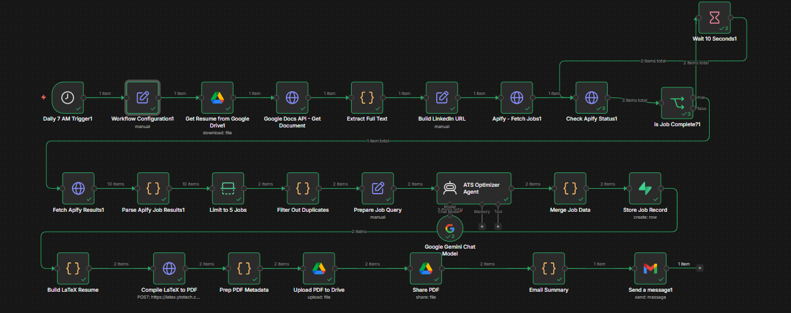

# 🤖 n8n AI Job Hunting Agent

> An automated, AI-powered job hunting workflow built with n8n that scrapes LinkedIn daily, tailors your resume for each job using Google Gemini, generates ATS-optimized PDF resumes, and delivers a structured email report — all running on autopilot every morning at 7AM.

---

## 📸 Workflow Overview



---

## ✨ Features

- 🔍 **LinkedIn Job Scraping** — Scrapes fresh remote AI/ML job listings daily via Apify
- 🤖 **AI Resume Tailoring** — Google Gemini rewrites your resume for each specific job
- 📄 **PDF Generation** — Compiles ATS-optimized LaTeX PDFs for each application
- ☁️ **Google Drive Upload** — Automatically uploads and shares tailored PDFs
- 📧 **Email Report** — Sends a daily HTML email with job links and resume links
- 🗄️ **Deduplication** — Supabase database prevents processing the same job twice
- ⏰ **Fully Automated** — Runs every morning at 7AM without any manual intervention

---

## 🏗️ Architecture

```
Daily 7AM Trigger
      ↓
Workflow Configuration (API keys, search query)
      ↓
Get Resume from Google Drive
      ↓
Extract Resume Text (Google Docs API)
      ↓
Build LinkedIn Search URL
      ↓
Apify Scrapes LinkedIn Jobs (last 24 hours)
      ↓
Check Apify Status (polling loop)
      ↓
Parse & Limit to 5 Jobs
      ↓
Filter Duplicates (Supabase check)
      ↓
Prepare Job Query
      ↓
ATS Optimizer Agent (Google Gemini rewrites resume)
      ↓
Merge Job + AI Output
      ↓
Store Job Record (Supabase deduplication)
      ↓
Build LaTeX Resume
      ↓
Compile LaTeX to PDF (latex.ytotech.com)
      ↓
Upload PDF to Google Drive
      ↓
Share PDF (public link)
      ↓
Email Summary (HTML table with job + resume links)
      ↓
Send Email (Gmail)
```

---

## 🛠️ Tech Stack

| Component | Technology |
|-----------|-----------|
| **Workflow Engine** | n8n (self-hosted) |
| **AI / LLM** | Google Gemini (gemini-flash) |
| **Job Scraping** | Apify — LinkedIn Jobs Scraper |
| **Database** | Supabase (PostgreSQL) |
| **Resume Storage** | Google Drive + Google Docs API |
| **PDF Compilation** | LaTeX via latex.ytotech.com |
| **Email Delivery** | Gmail OAuth2 |
| **Scheduling** | n8n Schedule Trigger (7AM daily) |

---

## 📧 Sample Email Output

The agent sends a daily HTML email like this:

| Company | Role | Posted | Job | Resume |
|---------|------|--------|-----|--------|
| Jobright.ai | Data Analyst, New Grad | 2026-05-15 | 🔗 View Job | 📄 PDF Resume |
| ImmunityBio | Senior Security Engineer AI | 2026-05-14 | 🔗 View Job | 📄 PDF Resume |

Each **📄 PDF Resume** is uniquely tailored by Gemini AI for that specific job!

---

## 🚀 Setup Guide

### Prerequisites

- n8n (self-hosted or cloud)
- Google Cloud account (for Drive + Docs API)
- Apify account (free tier)
- Supabase account (free tier)
- Gmail account

### Step 1 — Clone this repo

```bash
git clone https://github.com/Zaid0205/n8n-job-hunting-agent.git
```

### Step 2 — Import workflow into n8n

1. Open n8n
2. Click **"..."** → **"Import from file"**
3. Select `workflow.json`

### Step 3 — Create Supabase table

```sql
CREATE TABLE public.jobs (
  job_url TEXT PRIMARY KEY,
  job_title TEXT,
  company TEXT,
  processed_at TIMESTAMPTZ DEFAULT NOW()
);

ALTER TABLE public.jobs ENABLE ROW LEVEL SECURITY;

CREATE POLICY "Allow all operations" ON public.jobs
FOR ALL USING (true) WITH CHECK (true);
```

### Step 4 — Configure the Workflow Configuration node

Fill in these values in the **"Workflow Configuration1"** node:

| Field | Description |
|-------|-------------|
| `resumeFileId` | Your Google Doc resume ID (from URL) |
| `jobSearchQuery` | e.g. `AI Engineer Machine Learning entry level remote` |
| `userEmail` | Your Gmail address |
| `apifyActorId` | `curious_coder~linkedin-jobs-scraper` |
| `apifyToken` | Your Apify API token |
| `supabaseUrl` | Your Supabase project URL |
| `supabaseKey` | Your Supabase service role key |

### Step 5 — Set up credentials in n8n

- **Google Drive OAuth2** — for resume download and PDF upload
- **Gmail OAuth2** — for sending email reports  
- **Supabase** — for job deduplication

### Step 6 — Activate the workflow

Click **"Publish"** in n8n to activate the 7AM daily trigger!

---

## 📁 Repository Structure

```
n8n-job-hunting-agent/
├── workflow.json          ← n8n workflow (credentials removed)
├── README.md              ← This file
└── screenshots/
    ├── workflow.png       ← Full workflow canvas
    ├── email_sample.png   ← Sample email received
    └── resume_sample.png  ← Sample tailored PDF resume
```

---

## 🔒 Security Note

All credentials have been removed from `workflow.json`. 
Never commit real API keys to GitHub. Use n8n's built-in credential manager for secure storage.

---

## 💡 How It Works

### 1. Resume Tailoring (AI Magic ✨)
The **ATS Optimizer Agent** uses Google Gemini with a carefully crafted system prompt to:
- Extract keywords from the job description
- Rewrite resume bullet points to match job requirements
- Optimize for ATS (Applicant Tracking Systems)
- Maintain honesty — only highlights real skills

### 2. Deduplication
Every processed job URL is stored in Supabase. On subsequent runs, the **Filter Out Duplicates** node checks if a job has been seen before — preventing duplicate emails and wasted API calls.

### 3. PDF Generation
Gemini's output is formatted as LaTeX and compiled to a professional PDF using the moderncv template — the same format used by thousands of professionals worldwide.

---

## 📊 Results

After running this agent daily:
- ✅ Real LinkedIn jobs scraped and analyzed
- ✅ Unique AI-tailored resume generated per job
- ✅ PDFs uploaded to Google Drive automatically
- ✅ Daily email delivered with clickable links
- ✅ Zero duplicate jobs processed across runs

---

## 🎓 About

Built by **Zaid Ahmed** — Final Year BS(AI) Student at FAST NUCES, Lahore.

This project demonstrates:
- Agentic AI workflow design
- LLM prompt engineering for structured outputs
- API integration (Apify, Supabase, Google APIs, Gemini)
- Automated document generation (LaTeX → PDF)
- Production-grade n8n workflow architecture

📧 xaidahmed17@gmail.com  
🔗 [LinkedIn](https://linkedin.com/in/zaid-ahmed-0aa499231)  
💻 [GitHub](https://github.com/Zaid0205)

---

## 📄 License

MIT License — feel free to use and modify for your own job hunt!
